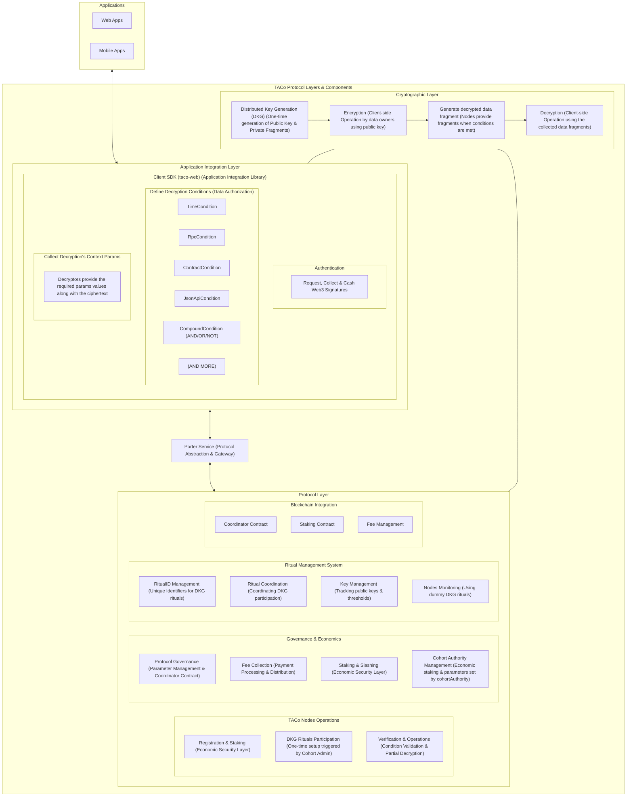

# TACo Protocol Layers & Components Diagram (Mermaid file)

RELATIONSHIPS:

1.  DRAW.IO FILE: Source of truth for visual representation of the TACo architecture
2.  SVG FILE: Direct visual export from the draw.io file for documentation display
3.  THIS FILE (MERMAID): Simplified LLM-friendly diagram based on the draw.io file

PURPOSE:
This Mermaid diagram provides a simplified version of the TACo architecture that is optimized for LLM processing and understanding. While it contains the same essential components and relationships as the draw.io diagram, it has been structured to be more easily parsed and understood by language models.

**NOTE: Update this file whenever significant changes are made to the draw.io file.**

