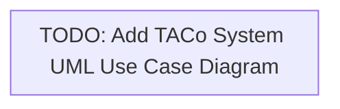

# TACo Protocol Use Case Diagram (Mermaid file)

RELATIONSHIPS:

1.  DRAW.IO FILE: Source of truth for visual representation of the use cases
2.  SVG FILE: Direct visual export from the draw.io file for documentation display
3.  THIS FILE (MERMAID): Simplified LLM-friendly diagram based on the draw.io file

PURPOSE:
This Mermaid diagram provides a simplified version of the TACo protocol use case diagram that is optimized for LLM processing and understanding. While it contains the same essential actors, use cases, and relationships as the draw.io diagram, it has been structured to be more easily parsed and understood by language models.

**NOTE: Update this file whenever significant changes are made to the draw.io file.**

**Note**: Mermaid doesn't have specific UML use case diagram support, so this diagram could probably use flowchart syntax to approximate the look and relationships of a use case diagram. For a true UML use case diagram, please refer to the draw.io or SVG files.
