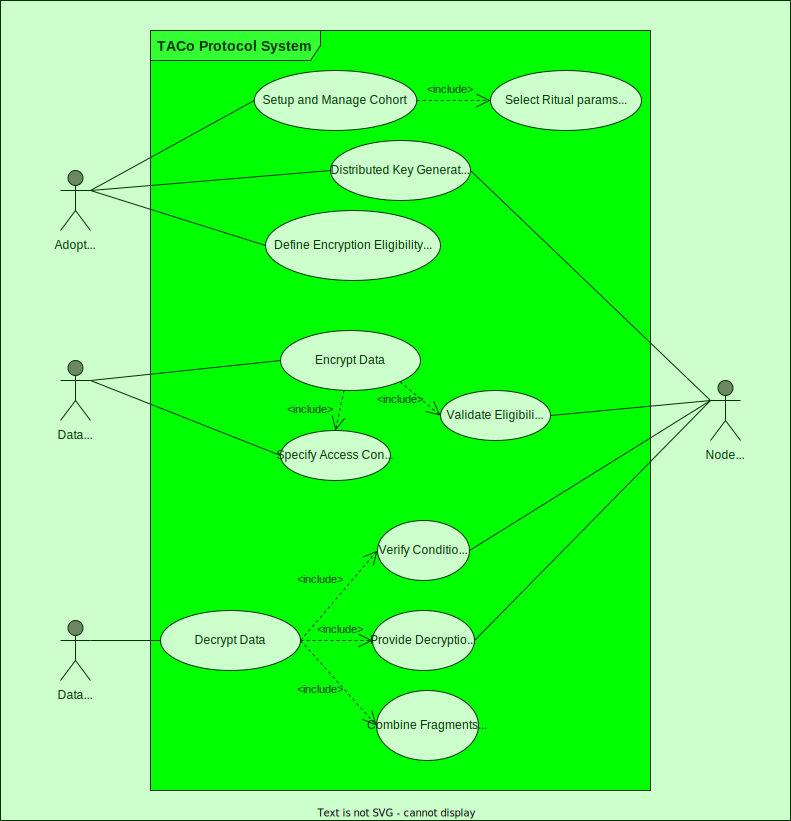

# TACo Protocol Use Cases

The TACo protocol enables secure, conditional access to encrypted data across a decentralized network. This document outlines the primary actors in the TACo ecosystem and their key interactions with the protocol.

## Core Actors

<figure><figcaption>
TACo Protocol Use Case Diagram
</figcaption></figure>

The TACo protocol facilitates interactions between four main actors:

### Adopting Developer (Cohort Authority)

The adopting developer integrates TACo into their application and becomes the `cohortAuthority`, responsible for:

- Initiating and managing the Distributed Key Generation (DKG) process
- Setting network parameters for their application's cohort
- Managing cohort composition and rotation policies
- Transferring cohort authority (optionally) to a multisig or DAO for decentralized governance

### Data Producer

Data producers are users or systems that want to share encrypted data with conditional access:

- Encrypt content using the public key generated by the DKG
- Specify access conditions that must be met before content can be decrypted
- Create logical combinations of conditions (AND, OR, NOT) for complex access patterns
- Distribute the encrypted content via channels outside the TACo protocol

### Data Consumer

Data consumers are users or systems that request access to encrypted content:

- Request decryption services from the TACo network
- Present authentication and verification materials to prove they meet access conditions
- Receive decryption fragments from nodes when conditions are met
- Combine fragments locally to decrypt content

### Node Operator

Node operators are entities that run TACo nodes in the network:

- Participate in DKG rituals to generate and manage key material
- Verify access conditions when decryption is requested
- Provide decryption fragments to qualified data consumers
- Stake tokens to secure network participation

## Primary Use Cases

### Distributed Key Generation

The DKG process is the foundation of the TACo protocol:

1. The adopting developer initiates the DKG ritual
2. A cohort of nodes (30-100) is selected from the network
3. Nodes collaboratively generate a unified public key and distribute private key fragments
4. The public key becomes available for data encryption

### Conditional Data Encryption

Data producers use TACo to create encrypted content with programmable access control:

1. The data producer retrieves the public key for their target application
2. They define access conditions that must be met for decryption
3. They encrypt their content locally using the public key
4. The conditions are embedded with the encrypted content
5. The encrypted package is distributed to potential consumers

### Conditional Data Decryption

Data consumers request access to encrypted content:

1. The consumer requests decryption from the TACo network
2. They provide authentication and condition-fulfillment proofs
3. Network nodes independently verify the consumer meets all conditions
4. Qualifying consumers receive decryption fragments from nodes
5. Once a threshold of fragments is received, the content can be decrypted locally

### Cohort Management

The TACo protocol includes mechanisms for managing node participation:

1. The cohortAuthority establishes cohort parameters
2. Node operators stake tokens to participate in the network
3. The cohortAuthority can define rotation policies for cohort membership
4. Cohort composition may change over time according to predefined rules

For a detailed explanation of how these use cases are implemented in the protocol's operations, see the [Protocol Flow](./protocol-flow.md) document.
