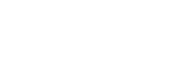

# Waku + Codex


<div><figure><figcaption></figcaption></figure> <figure><figcaption></figcaption></figure> <figure><figcaption></figcaption></figure></div>

Using _Codex_, _Waku_, and _TACo_ together gives developers a powerful, fully decentralized stack for building secure, censorship-resistant applications. _Waku_ enables real-time, peer-to-peer communication without relying on centralized servers, while _Codex_ provides verifiable, durable storage for any type of content. _TACo_ adds a layer of programmable access control and encryption, allowing developers to define precise conditions for data access.

## Waku overview

**Waku's** communication protocols provide gas-free message transport and routing – supporting in-browser light clients, and ensuring protocol-level metadata privacy and end-user anonymity. Ephemeral, real-time messaging with minimal persistence brings efficient data/message transmission within adopting applications. Like TACo, Waku's underlying network makes no compromises with respect to permissionlessness, trust-minimization and decentralization.

For more on Waku's JavaScript SDK, check out their [documentation](https://docs.waku.org/guides/js-waku/).

## Codex overview

**Codex** is a decentralized data storage protocol designed to provide strong censorship resistance and durability guarantees. It aims to address the shortcomings of centralized cloud storage—such as censorship, lack of data ownership, security breaches, and high costs. By leveraging a decentralized network of storage providers, Codex ensures data is stored reliably and remains accessible without relying on centralized entities.

For further information Codex, follow their [documentation](https://docs.codex.storage/) or [API specification](https://api.codex.storage/).

***

## Use case ideas

The combination of communication (_Waku_), storage (_Codex_), and Access Control (_TACo_) layers enable a wide range of use cases, powering practical and fully decentralized solutions such as:

* **Collaboration Apps.** Decentralized alternative to _Google Docs_ or _Office 365,_ offering fine-grained access control. Documents and version history are stored using _Codex,_ while _Waku_ protocol enables real-time synchronization and user notifications. _TACo_ handles access control for all shared content.
* **Voting and Governance.** An organization that shares proposals and collects votes in real time with verifiable, tamper-resistant outcomes. While _TACo_ keeps votes anonymous until results are revealed thanks to its access control conditions, _Waku_ distributes ballots and proposals in real time to eligible voters, and results are publicly and verifiably stored by _Codex_.
* **Data markets.** A decentralized marketplace where researchers or companies can exchange sensitive datasets securely and without intermediaries. _Codex_ serves as a powerful tool to host these datasets in a decentralized network, _Waku_ facilitates peer-to-peer negotiation of data exchanges, and TACo enforces conditional access (e.g., after payment or approval).
* **Social networks.** Social platforms -such as forums, media-sharing apps, and microblogging sites) can benefit from decentralized storage of posts, profiles, images, and videos using _Codex._ _Waku_ is well-suited for notifications, user updates and real-time chat, while _TACo_ provides access control to posts and social data.

***

## Example application

[_Cyphershare_](https://github.com/hackyguru/cyphershare) is a secure file sharing decentralized application that leverages Codex for storage, Waku for peer-to-peer communication, and TACo for end-to-end encryption and access control. By using Cyphershare, users can securely share files by encrypting them in the browser before upload, ensuring that only authorized recipients -those meeting predefined TACo conditions such as holding a specific token balance or within a time-limited access windows- can decrypt and access the content.

The running application can be found here: [CypherShare](https://share.hackyguru.com/)

***

## Integration steps

This section walks through a minimum viable integration to get developers started. For more powerful extensions and advanced condition logic, check out the [Conditions](../../taco-sdk/references/conditions/) section.

### 1. Required imports

```typescript
// Waku SDK components for decentralized messaging
import { createLightNode, createEncoder, createDecoder, waitForRemotePeer } from '@waku/sdk'

// TACo components for conditional encryption
import { initialize, encrypt, decrypt, conditions, domains, ThresholdMessageKit } from '@nucypher/taco';

// Authentication provider for TACo
import { EIP4361AuthProvider, USER_ADDRESS_PARAM_DEFAULT } from '@nucypher/taco-auth';

// Ethereum interaction library
import { ethers } from 'ethers';
```

### 2. Create and set up a Waku light node

<pre class="language-typescript"><code class="lang-typescript">const lightNode = await createLightNode({
  defaultBootstrap: false,
  networkConfig: {
    clusterId: 42,
    shards: [0]
  },
});

await lightNode.start();
<strong>
</strong>// Define your application's content topic: /&#x3C;application-name>/&#x3C;version>/&#x3C;content-type>/&#x3C;encoding>
const CONTENT_TOPIC = `/fileshare/1/room-${roomId}/proto`;

// Create Waku's encoder and decoder
const encoder = createEncoder({ contentTopic: CONTENT_TOPIC });
const decoder = createDecoder(CONTENT_TOPIC);
</code></pre>


Note that _content topics_ are metadata strings embedded into outgoing messages that facilitate protocol-level features like selectively processing incoming messages. These strings can be thought of as 'channels', which determine, among other things, the path of messages through the network. Learn more about content topics [here](https://docs.waku.org/learn/concepts/content-topics/).


### 3. Send and receive Waku messages

```typescript
// Function that handles the received message
const messageHandler = (wakuMessage: DecodedMessage) => {
}

// Subscribe to content topic
const subscription = await lightNode.filter.subscribe(
  [decoder],
  messageHandler
);

// Send a message
const serializedMessage = FileMessage.encode(protoMessage).finish();

await node.lightPush.send(
  encoder,
  { payload: serializedMessage }
)
```

### 4. Download and upload files from Codex


Codex uses a REST API to interact with the nodes, so the complexity of handling HTTP requests is intentionally omitted in this section to keep the focus on the essential concepts. Only the relevant parts are show. The complete documentation for this API is in the [Codex API](https://api.codex.storage/) page.


Upload a file to Codex:

```typescript
const url = `/api/codex/v1/data`;
const xhr = new XMLHttpRequest();

// The file to be uploaded
const file = ... [File]

xhr.setRequestHeader('Content-Type', file.type);
xhr.setRequestHeader(
  'Content-Disposition',
  `attachment; filename='${file.name}'`
);

xhr.onload = function () {
  if (xhr.status >= 200 && xhr.status < 300) {
    // Extract the CID from the response
    const cid =
      typeof response === 'object'
        ? response.id ||
          response.cid ||
          (response.data && (response.data.id || response.data.cid))
        : response;
  }
}

xhr.send(file);
```

Download a file from Codex:

<pre class="language-typescript"><code class="lang-typescript"><strong>// CID is the Codex file ID.
</strong><strong>const cid = ...
</strong>const downloadUrl = `/api/codex/v1/data/${cid}/network/stream`;

const response = await fetch(downloadUrl, {
  method: 'GET',
  headers: {
    Accept: '*/*',
    ...(this.authHeaders || {}),
  },
  mode: 'cors',
  credentials: 'include',
});

const data = await response.blob();
</code></pre>

### 5. Encryption and decryption with TACo

Initialize TACo:

```typescript
await initialize()
```

Define access conditions:

<pre class="language-typescript"><code class="lang-typescript">const condition = new conditions.base.rpc.RpcCondition({
  chain: chainId,
  method: "eth_getBalance",
<strong>  parameters: [":userAddress", "latest"],
</strong>  returnValueTest: {
    comparator: ">",
    value: 0,
<strong>  },
</strong>});
</code></pre>

Encrypt files:

<pre class="language-typescript"><code class="lang-typescript"><strong>const ritualId = 6 // This is a testnet-specific ritual ID
</strong>
// Read file as ArrayBuffer
const arrayBuffer = await file.arrayBuffer();
const data = new Uint8Array(arrayBuffer);

const messageKit = await encrypt(
  provider,
  domain,
  data,
  condition,
  ritualId,
  encryptorSigner // ethers.Signer
);

const bytesToUpload = messageKit.toBytes();
</code></pre>

Decrypt files:

```typescript
const messageKit = ThresholdMessageKit.fromBytes(encryptedBytes);
const authProvider = new EIP4361AuthProvider(provider, signer);
const conditionContext =
  conditions.context.ConditionContext.fromMessageKit(messageKit);
conditionContext.addAuthProvider(
  USER_ADDRESS_PARAM_DEFAULT,
  authProvider
);

const result = await decrypt(
  provider,
  domain,
  messageKit,
  conditionContext
);
```

***

## Using Waku + Codex + TACo in production

Waku is currently used to enable private communication in applications such as RAILGUN and Status. Research and development continue with their decentralized DoS protection protocol being trialed on testnet.

_Codex_ is currently operating a public, non-incentivized testnet that is open to developers and contributors.

Regarding _TACo_, the parameters specified in this guide are for testing and hacking only. For real-world use cases, the production version of _TACo_ is required – i.e. a funded Mainnet `ritualID` which connects the encrypt/decrypt API to a cohort of independently operated nodes, and corresponds to a DKG public key generated by independent parties.

Ready to use _TACo_ in production? Check out the [Mainnet Access](../../../migration-to-mainnet/mainnet-taco-beta-program.md) section for everything you need.
