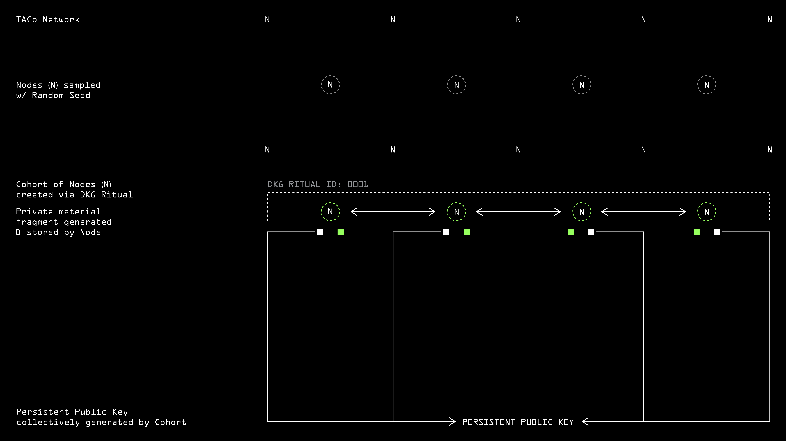
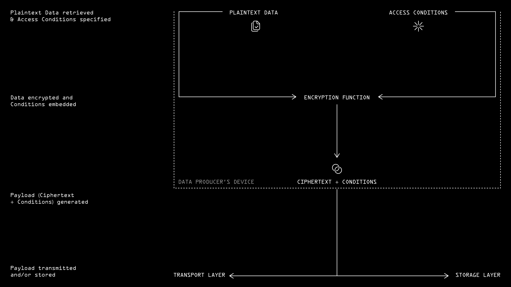
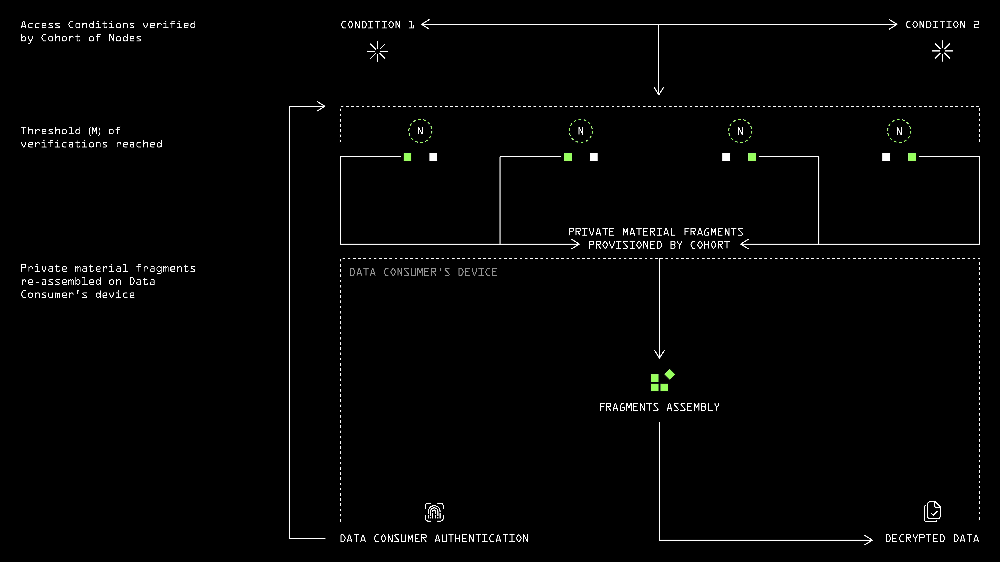

# Access Control

In a typical flow, private data is encrypted client-side by a _data producer._ This data payload will remain encrypted until it reaches the device of a qualifying _data consumer_. From a privacy point of view, this is equivalent to the end-to-end encryption guarantees in a messaging app like Signal. However, TACo is general-purpose and can protect data flows in all types of applications, rather than being optimized for point-to-point textual communication.&#x20;

Whether or not a _data consumer_ qualifies to decrypt and view a given data payload depends on whether they fulfill certain access conditions. These conditions are specified in advance by the producer or owner of that data, or programmed into the application logic on their behalf. For example, a journalist-facing app might predicate access to submitted evidence based on the proven location of the witness (out of harm's way). \
\
To access the data, a given _data consumer_ will have to (1) authenticate themselves and (2) present proof they fulfill the pre-specified conditions. Both are evaluated by a group of TACo nodes, each of which individually validates the data consumer's request by comparing it to retrieved web/web3 state. For example, if perishable health data should not be shared after a certain date, TACo nodes will simply read the UNIX epoch via Ethereum's `block.timestamp` value.&#x20;

If a sufficient number (a 'threshold') of nodes confirm that the requesting _data consumer_ qualifies to see the data, each will send a decryption fragment to the consumer. These fragments can be combined by the data consumer client-side to access the private data. This private data could be the actual content or, more commonly, a symmetric key that provides a lightweight method to access an underlying payload.

## Key concepts

### **Threshold Decryption**

Under the hood, TACo involves splitting a joint secret – a decryption key – into multiples _shares_ and distributing those among authorized and collateralized node operators (stakers in the Threshold network). The secret has an associated public key that can be used for encryptions. A minimum number – a _threshold_ – of those nodes holding the key shares must be online and actively participate in partial decryptions. These are subsequently combined on the requester's client to reconstruct the original plaintext data that was encrypted using the associated public key.

### **Conditionality**

Conditions are 'attached' on a per-ciphertext basis. In other words, each and every payload, message or bit can be access-restricted by a unique set of specified conditions. A range of access control condition types can be defined by the _adopting developer_ and/or _data producer._ For more on condition logic, check out the [conditions](../../for-developers/taco-sdk/references/conditions/ "mention") section.&#x20;

## End-to-end data sharing flow

### Stage 0 | Distributed Key Generation | App Developer&#x20;

<figure><picture><source srcset="../../.gitbook/assets/TACo-diagrams-doc-transparent-02.png" media="(prefers-color-scheme: dark)"></picture><figcaption>
Nodes sampled and DKG ritual initialized
</figcaption></figure>

We start from the _adopting developer_'s perspective – i.e. the developers of an application that has integrated TACo. \
\
The first stage – a Distributed Key Generation initialization ritual – assigns the adopting developer the role of `cohortAuthority`. This grants the developer control over the group of nodes which enforce access control within their app, but no power to decrypt private data shared by their users.  Note that `cohortAuthority` power is easily transferred to a multisig or DAO. &#x20;

Firstly, the `cohortAuthority` samples a cohort of nodes from the network. Typically the list of nodes to populate a cohort is generated using a replicable random seed, to prove later that the nodes were not hand-picked. The minimum cohort size is 30, and can be as large as 100.&#x20;

The sampled nodes will now conduct a DKG initialization ritual, which involves generating transcripts, aggregating transcripts locally, and cross-verifying the aggregates. If any of the nodes submits an incorrect entry, the DKG ritual fails and must start over. That implies that a minimum of one honest party is required at this stage to ensure the secret material is not spoofed.

DKG initializations generate private and public material. The public material combines into a persistent public key, used in the next step by the encryption function. Each node holds onto their fragment of private material, which they will later individually provision to qualifying data consumers.&#x20;

### **Stage 1 | Encryption & Condition Specification | Data Producer**&#x20;

<figure><picture><source srcset="../../.gitbook/assets/TACo-diagrams-doc-transparent-03.png" media="(prefers-color-scheme: dark)"></picture><figcaption>
Plaintext data encrypted and access conditions specified
</figcaption></figure>

We now switch to the _data producer_'s perspective – we'd like to encrypt and share some private data. We first specify the conditions for accessing the data.

For example, imagine the data producer is a creator on a decentralized Twitch, and wishes to create a paywall for a special livestream. They will only allow a viewer to decrypt the stream if they (a) hold a minimum number of a special purpose NFT, (b) either purchased a previous NFT OR follow the creator on X/Twitter/Mastodon, and (c) the stream will be non-accessible to anyone after 24h. \
\
All these conditions are composed into a `conditionSet` , which can be constructed as a logical sequence – e.g. only check the X API if the prospective data consumer holds below some number of NFTs). \
\
The data producer encrypts the raw data using the Public Key to product a unique secret. This secret will be combined with the tamper-proof conditions to form a ciphertext/payload.

The payload is then transmitted to recipients via a transport layer and/or uploaded to a storage layer. Note that TACo is agnostic to the storage layer and TACo nodes do not store any data.

### Stage 2 |  Authentication & Condition Verification | Data Consumer

<figure><picture><source srcset="../../.gitbook/assets/TACo-diagrams-doc-transparent-04.png" media="(prefers-color-scheme: dark)"></picture><figcaption>
Requestor authenticated, access conditions verified, decryption material provisioned &#x26; data decrypted
</figcaption></figure>

Finally, switching to the _data consumer_'s perspective. Our first step is to retrieve the encrypted payload.

Next, the data consumer presents the payload to the cohort, along with whatever authentication message or proof is required to prove their identity. For example, the message can be as simple as a Sign In With Ethereum 'pass through', where the app has already authenticated the user. The authentication method can also use OAuth, ERC-4337 smart contract wallets, or choose which auth to require at decryption time based on the conditions. \
\
Following authentication, each individual node verifies that the access conditions are fulfilled by the data consumer. In our decentralized Twitch streamer example, this would involve retrieving on-chain state to check transaction history, NFT ownership, and blocktime, and off-chain state to check the creator's X follower list.&#x20;

Normally, all the nodes will agree. However, the threshold design means there’s no issue if one or two nodes are unreachable, and also prevents a malicious minority from sharing data with illegitimate data consumers.\
\
For each validating node, if the access conditions are met, a decryption fragment is then provided to the consumer. Once a threshold of nodes (e.g. 26 of 50) has provisioned their fragments, the data consumer can locally assemble these fragments to decrypt the payload.&#x20;

Normally, the 'plaintext data' is a symmetric key that is then used to decrypt the underlying data, via TACo's KEM/DEM mechanism. 


