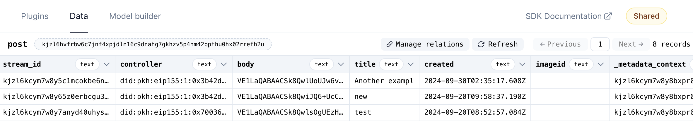

# Ceramic OrbisDB

## OrbisDB overview

Powered by [Ceramic](https://ceramic.network/), OrbisDB is a fully open-source relational database solution designed for blockchain applications.

The Ceramic network provides assurances regarding data ownership, composability, scalability. And built on top of this, OrbisDB offers a rapid Ceramic onboarding and developer experience through a web app and SDK for storing and managing datasets, support for SQL and GraphQL queries, and hosted nodes to make DevOps easier.

At the same time, decentralization is ensured by the hundreds of node operators and the fact that anyone can join the network by simply running their own node.

As in the case of [ComposeDB integration](ceramic-composedb.md), OrbisDB can be easily combined with TACo to ensure encryption of the stored data that will be only decryptable by parties satisfying pre-specified conditions.

## Use cases

* **Social networks.** Ceramic network offers data ownership and resilience against censorship. Adding a built-in solution for encrypting and decrypting as TACo ensures that private user-generated content is only viewable by those who are supposed to see it, and nobody else.
* **Web apps.** In web applications, data storage and persistence are crucial aspects that rely on databases. Given the necessity of decentralization in Web3, integrating OrbisDB and TACo can facilitate distributed and encrypted data storage, enabling the decryption of information based on pre-existing conditions.
* **DeSci.** One of the key aspects of Decentralized Science is the sharing of data for scientific publications using Web3 technologies. The combination of OrbisDB and TACo will make it possible to store this scientific data in a secure and decentralized way, allowing transparency and easy sharing of this data. TACo enables the secure encryption of sensitive information and ensures that decryption can only be performed by the intended parties. TACo also facilitates the existence of scientific data marketplaces so researchers and data producers can monetize their data, which can only be decrypted under certain conditions.

***


&#x20;A full example application can be found at [taco-orbisdb-demo](https://github.com/nucypher/taco-orbisdb-demo) - a web forum that contains posts, comments, images, and personal profiles.


## Integration steps

### 1. Install required dependencies

Ensure that you have the required packages in your `package.json` by running:

```bash
npm install @nucypher/taco @nucypher/taco-auth ethers
```

### 2. Update the network configuration

We need to update the chain configuration to support the desired networks.

<pre class="language-typescript" data-title="app/context/WalletContext.tsx" data-full-width="false"><code class="lang-typescript">```
import { getDefaultConfig } from '@rainbow-me/rainbowkit';
<strong>import { polygonAmoy } from 'wagmi/chains';
</strong>
const config = getDefaultConfig({
  appName: 'test-app',
  projectId,
  chains: [polygonAmoy],
  ssr: true,
});
</code></pre>

This configuration ensures your app interacts with the correct testnet network for TACo development.

Note that Polygon Amoy testnet is the L2 for [TACo testnet domains](../taco-integration/get-started-with-tac.md#testnet-configuration), so the calls to encryption and decryption will go through this network.

### 3. Initialize TACo

TACo requires initialization, i.e., WASM modules need to be loaded. This should be done on application startup. For Next.js applications, it is recommended to use a React Context to check if TACo has been initialized before to avoid initializing it repeatedly.


```typescript
import { useEffect, useState } from "react";
import { initialize } from '@nucypher/taco';

const [isInitialized, setIsInitialized] = useState(false);

const initializeTACo = useCallback(() => {
  initialize().then(() => setIsInitialized(true));
}, [setIsInitialized]);

useEffect(() => {
  if (!isInitialized) {
    initializeTACo();
  }
},[initializeTACo, isInitialized]);
```


### 4. Define decryption conditions

The decryption conditions for the data to be encrypted are set at encryption time, so we need to define them. The different types of conditions can be found in the [Access Control](../conditions/).


```typescript
import { conditions } from "@nucypher/taco";

const condition = new conditions.base.rpc.RpcCondition({
  chain: 80002,
  method: "eth_getBalance",
  parameters: [":userAddressExternalEIP4361"],
  returnValueTest: {
    comparator: ">",
    value: 0,
  },
});
```


In the code example above, we set that only those decryptor accounts with a positive POL balance on Polygon Amoy (chain ID `80002`) will be able to decrypt the data.

### 5. Add TACo encryption and decryption utilities

One option to integrate the encrypt and decrypt functions into a Next.js application could be to create a new React Custom Hook. There are two core functions that we would like to implement: `encryptWithTACo` and `decryptWithTACo`. In this example, these functions ensure that posts are encrypted before being stored in OrbisDB and decrypted after being queried.

#### Auxiliary functions

First, we have these two utility functions that are going to be used on the main functions for encoding/decoding base64 strings.


```typescript
function encodeB64(uint8Array: any) {
  return Buffer.from(uint8Array).toString("base64") as String;
}

function decodeB64(b64String: any) {
  return new Uint8Array(Buffer.from(b64String, "base64"));
}
```


So now, we can define the two main encryption and decryption functions:

#### encryptWithTACo()

`encryptWithTACo()` function encrypts a message and sets the conditions for decrypting it. The returned value is a base64 string that contains the encrypted message and the decryption conditions.


```typescript
const domain = "tapir";
const ritualId = 6;

async function encryptWithTACo(
  messageToEncrypt: string,
  condition: conditions.condition.Condition,
  provider: ethers.providers.Provider,
  signer: ethers.Signer,
) {
  const tmk = await encrypt(
    provider,
    domain,
    messageToEncrypt,
    condition,
    ritualId,
    signer,
  );

  return encodeB64(tmk.toBytes());
}
```


#### decryptWithTACo()

`decryptWithTACo()` takes a base64 string with the encrypted data and decrypts the message if the conditions are met.

A relevant part of the decryption process is the authentication of the decryptor, i.e. to provide a proof that the decryptor owns its address. In this example, we **reuse** the SIWE authentication already implemented by OrbisDB instead of asking the user to sign another message to authenticate themself again.


```typescript
import { SiweMessage } from "@didtools/cacao";
import { DIDSession } from "did-session";
import {
  SingleSignOnEIP4361AuthProvider,
  USER_ADDRESS_PARAM_EXTERNAL_EIP4361,
} from "@nucypher/taco-auth";
import { ethers } from "ethers";

// Aux function to get the OrbisDB SIWE session from local storage
async function loadSiweFromOrbisSession(): Promise<{
  message: string | undefined;
  signature: string | undefined;
}> {
  const session = localStorage.getItem("orbis:session");
  const didSession = await DIDSession.fromSession(session);
  const siweMessage = SiweMessage.fromCacao(didSession.cacao);
  const message = siweMessage.toMessageEip55();
  const signature = siweMessage.signature;
  return { message, signature };
}

async function decryptWithTACo(
  encryptedMessage: string,
  provider: ethers.providers.Provider,
) {

  const siweInfo = await loadSiweFromOrbisSession();
  const authProvider =
    await SingleSignOnEIP4361AuthProvider.fromExistingSiweInfo(
      siweInfo.message,
      siweInfo.signature,
    );

  const tmk = ThresholdMessageKit.fromBytes(decodeB64(encryptedMessage));
  const conditionContext =
    conditions.context.ConditionContext.fromMessageKit(tmk);
  conditionContext.addAuthProvider(
    USER_ADDRESS_PARAM_EXTERNAL_EIP4361,
    authProvider,
  );

  try {
    const decrypted = await decrypt(provider, domain, tmk, conditionContext);
    return new TextDecoder().decode(decrypted);
  } catch (error) {
    console.error("Decryption failed:", error);
    return "<Decryption failed>";
  }
}
```


***

## Demo: encrypting and decrypting forum posts

The full demo application can be found at [taco-orbisdb-demo](https://github.com/nucypher/taco-orbisdb-demo).

This demo consists of a web forum that contains posts, comments, images, and personal profiles.

We are adding encryption to the post bodies so only decryptors that meet the conditions can see them. Also, we execute a query to store the posts on OrbisDB in an encrypted format that can only be decrypted by authorized users with access:


```typescript
import { conditions } from "@nucypher/taco";
import useTaco from "@/app/hooks/useTaco";

const { encryptWithTACo } = useTaco();

const createPost = async (): Promise<void> => {
    // [...]
    
    // define TACo condition to decrypt the body of the post
    const condition = new conditions.base.rpc.RpcCondition({
      chain: 80002,
      method: "eth_getBalance",
      parameters: [":userAddressExternalEIP4361"],
      returnValueTest: {
        comparator: ">",
        value: 0,
      },
    });

    // encrypt post with TACO
    const encryptedBody = await encryptWithTACo(
      body,
      condition,
      provider,
      signer,
    );

    // [...]

    // Upload the forum post with the encrypted data to OrbisDB
    const createQuery = await orbis
        .insert(POST_ID)
        .value({
            title,
            body: encryptedBody,
            imageid: imageUrl ? imageUrl : "",
            created,
          })
          .context(CONTEXT_ID)
          .run();

    // [...]
}
```


The decryption of the post bodies happens on the client side when loading them from OrbisDB:


```typescript
import useTaco from "@/app/hooks/useTaco";

const [decryptedBody, setDecryptedBody] = useState<string | undefined>(
    undefined,
);

const { decryptWithTACo } = useTaco();

const getPost = async (stream_id: string): Promise<void> => {
    // [...]
    
    const provider = new ethers.providers.Web3Provider(window.ethereum);
    
    // [...]
    // After a SQL query, the post data is stored at postResult[0] variable
    
    decryptWithTACo(postResult[0].body, provider).then((decrypted) => {
        if (decrypted) {
            setDecryptedBody(decrypted.toString());
        }
    });
    
    // [...]
}

```


With a running demo it is possible to check the encrypted post bodies being uploaded to the database using [OrbisDB Studio](https://studio.useorbis.com/). So we can be sure that the only people with access to our posts are those that satisfy the conditions we have set.

<figure><figcaption></figcaption></figure>

***

## Conclusion

By following the steps outlined in this tutorial, we have successfully integrated **TACo** into your application to handle decentralized, privacy-preserving encryption and decryption for posts and comments. This integration ensures that user data remains encrypted and secure, while still allowing authorized access using **threshold cryptography**.

This setup is ideal for decentralized apps (dApps) where user privacy and data security are crucial. You can extend this integration to other parts of your application or adapt it for other use cases.


