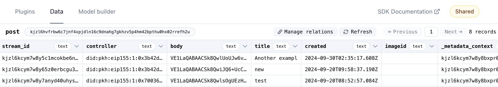

# OrbisDB

This guide walks through how to use [OrbisDB](https://developers.ceramic.network/docs/introduction/orbisdb-overview) and TACo in combination, using the DeForum web application and [repo](https://github.com/nucypher/deforum-taco) as an example. OrbisDB is an easy-to-use SQL interface for querying data stored via the [Ceramic](https://ceramic.network/) network, and alongside TACo, another fundmental building block for the Web3 stack.&#x20;


DeForum is a decentralized web forum that allows end-users to create token-gated posts, make comments, upload images, and build personal profiles. There are two synced reference repos, one hosted by [nucypher](https://github.com/nucypher/deforum-taco) (TACo) and one by [ceramicstudio](https://github.com/ceramicstudio/deforum-taco) (OrbisDB).


## OrbisDB overview

Built upon [Ceramic](https://ceramic.network/), OrbisDB is an open-source relational database designed for Web3 applications and beyond. OrbisDB offers a flexible and developer-friendly experience via a (1) web app & SDK for storing and managing datasets, (2) support for SQL and GraphQL queries, and (3) hosted nodes to facilitate DevOps.  The Ceramic network, as with ComposeDB, enables sovereign data ownership, composability and scalability. Decentralization is achieved through a population of node operators numbering in the hundreds, that anyone can permissionlessly join to provide  data services.&#x20;

## Use case ideas

* **DeSci.** Even movements centered around open access necessitate private channels, including draft papers, raw data analysis, peer reviews, funding, and other forms of collaboration. OrbisDB and TACo together offer storage and sharing of scientific work that maximizes the researcher's control and sovereignty. Additionally, the combination enables scientific data marketplaces with no trusted intermediary facilitating monetization.&#x20;
* **AI datasets.** Leverage OrbisBD's provenance verification tooling and TACo's granular (row-level) conditionality to enable safe collaboration on sensitive training data while simultaneously verifying data integrity and quality.&#x20;
* **Shared knowledge bases.** Combine Ceramic's verifiable credentials with credential-based secrets management to enforce fine-grained, per-page access to organizational resources. OrbisDB enables migration of non-public external data (e.g. via an API or static CSV) which can then be encrypted via TACo for specific group members (e.g. stakers in a network).&#x20;

***

## Example application & repo&#x20;

[DeForum](https://github.com/ceramicstudio/deforum-taco) illustrates how TACo and OrbisD can be combined in a browser-based forum app, and also provides a template for virtually any form of token-gated content platform. The demo can run on a public node instance provided by OrbisDB studio for testing, or you can set up your own node in order to save data on the Ceramic network in production. The demo also requires a ThirdWeb account to help with image file upload and storage on IPFS.&#x20;

Skip to Section II below for an in-depth guide to leveraging TACo in the context of the DeForum app.&#x20;

***

## Section I – Integration steps

This section covers how TACo can be used in concert with OrbisDB across domains and use cases. Follow these instructions to integrate TACo into your OrbisDB app.&#x20;

### 1. Install required dependencies

Ensure that you have the required packages in your `package.json` by running:

```bash
npm install @nucypher/taco @nucypher/taco-auth ethers
```

### 2. Update network configuration

Next, update the chain configuration:

<pre class="language-typescript" data-title="app/context/WalletContext.tsx" data-full-width="false"><code class="lang-typescript">import { getDefaultConfig } from '@rainbow-me/rainbowkit';
<strong>import { polygonAmoy } from 'wagmi/chains';
</strong>
const config = getDefaultConfig({
  appName: 'test-app',
  projectId,
  chains: [polygonAmoy],
  ssr: true,
});
</code></pre>

Polygon Amoy is the L2 for TACo's testnet [domains](../taco-integration/get-started-with-tac.md), so encryption/decryption calls from your app go via this network.

### 3. Initialize TACo

Next, intialize TACo by loading WASM modules:&#x20;


```typescript
import { useEffect, useState } from "react";
import { initialize } from '@nucypher/taco';

const [isInitialized, setIsInitialized] = useState(false);

const initializeTACo = useCallback(() => {
  initialize().then(() => setIsInitialized(true));
}, [setIsInitialized]);

useEffect(() => {
  if (!isInitialized) {
    initializeTACo();
  }
},[initializeTACo, isInitialized]);
```


&#x20;TACo initialization is required on application startup. For Next.js applications, it is recommended to use a React Context to check if TACo has been initialized before to avoid repeating this process unnecessarily.

### 4. Define access/decryption conditions

Next, define the conditions for accessing private data:&#x20;


```typescript
import { conditions } from "@nucypher/taco";

const condition = new conditions.base.rpc.RpcCondition({
  chain: 80002,
  method: "eth_getBalance",
  parameters: [":userAddress"],
  returnValueTest: {
    comparator: ">",
    value: 0,
  },
});
```


Access conditions are specified at data encryption time. The various types of conditions can be found in the Access Control [section](../conditions/).&#x20;

In the code snippet above, we specified that only those data consumer accounts with a positive POL balance on Polygon Amoy (chain ID `80002`) will qualify to decrypt the data. You can hardcode conditions, or create a UI for users to choose their own requirements for data access.&#x20;

### 5. (Optional) Add TACo encryption and decryption utilities

It's possible to integrate the `encrypt` and `decrypt` functions into a Next.js application by creating a new React Custom Hook. The two core functions to implement are `encryptWithTACo` and `decryptWithTACo`.&#x20;

In this example, these functions ensure that posts are encrypted before being stored in OrbisDB and decrypted after being queried.

First, create **auxiliary functions** – encoding/decoding base64 strings – to be used with the main functions later:&#x20;


```typescript
function encodeB64(uint8Array: any) {
  return Buffer.from(uint8Array).toString("base64") as String;
}

function decodeB64(b64String: any) {
  return new Uint8Array(Buffer.from(b64String, "base64"));
}
```


Next, define the two main encryption and decryption functions:

The `encryptWithTACo()` function encrypts a message and simultaneously sets the conditions for decrypting it. The returned value is a base64 string that contains the encrypted message and the decryption conditions.


```typescript
const domain = "tapir";
const ritualId = 6;

async function encryptWithTACo(
  messageToEncrypt: string,
  condition: conditions.condition.Condition,
  provider: ethers.providers.Provider,
  signer: ethers.Signer,
) {
  const tmk = await encrypt(
    provider,
    domain,
    messageToEncrypt,
    condition,
    ritualId,
    signer,
  );

  return encodeB64(tmk.toBytes());
}
```


The `decryptWithTACo()` function takes a base64 string with the encrypted data and decrypts the message if the conditions are met.

A creitcal part of the decryption process is the authentication of the data consumer. In this case, the data consumer (or requestor) proves that they own a given Ethereum address – specifically via the **reuse** of an SIWE authentication. Users have already authenticated themselves on OrbisDB, so this avoids them signing the same message again.&#x20;


```typescript
import { SiweMessage } from "@didtools/cacao";
import { DIDSession } from "did-session";
import {
  SingleSignOnEIP4361AuthProvider,
  USER_ADDRESS_PARAM_DEFAULT,
} from "@nucypher/taco-auth";
import { ethers } from "ethers";

// Aux function to get the OrbisDB SIWE session from local storage
async function loadSiweFromOrbisSession(): Promise<{
  message: string | undefined;
  signature: string | undefined;
}> {
  const session = localStorage.getItem("orbis:session");
  const didSession = await DIDSession.fromSession(session);
  const siweMessage = SiweMessage.fromCacao(didSession.cacao);
  const message = siweMessage.toMessageEip55();
  const signature = siweMessage.signature;
  return { message, signature };
}

async function decryptWithTACo(
  encryptedMessage: string,
  provider: ethers.providers.Provider,
) {

  const siweInfo = await loadSiweFromOrbisSession();
  const authProvider =
    await SingleSignOnEIP4361AuthProvider.fromExistingSiweInfo(
      siweInfo.message,
      siweInfo.signature,
    );

  const tmk = ThresholdMessageKit.fromBytes(decodeB64(encryptedMessage));
  const conditionContext =
    conditions.context.ConditionContext.fromMessageKit(tmk);
  conditionContext.addAuthProvider(
    USER_ADDRESS_PARAM_DEFAULT,
    authProvider,
  );

  try {
    const decrypted = await decrypt(provider, domain, tmk, conditionContext);
    return new TextDecoder().decode(decrypted);
  } catch (error) {
    console.error("Decryption failed:", error);
    return "<Decryption failed>";
  }
}
```


***

## Section II – Encrypting & decrypting forum posts via the DeForum web application&#x20;

Below, forum post bodies are encrypted so only data consumers that satisfy given conditions can view them as plaintext. The following code snippet also executes query to store the posts on OrbisDB in said encrypted format, so that only authenticated and qualifying consumers can access them.&#x20;


```typescript
import { conditions } from "@nucypher/taco";
import useTaco from "@/app/hooks/useTaco";

const { encryptWithTACo } = useTaco();

const createPost = async (): Promise<void> => {
    // [...]
    
    // define TACo condition to decrypt the body of the post
    const condition = new conditions.base.rpc.RpcCondition({
      chain: 80002,
      method: "eth_getBalance",
      parameters: [":userAddress"],
      returnValueTest: {
        comparator: ">",
        value: 0,
      },
    });

    // encrypt post with TACO
    const encryptedBody = await encryptWithTACo(
      body,
      condition,
      provider,
      signer,
    );

    // [...]

    // Upload the forum post with the encrypted data to OrbisDB
    const createQuery = await orbis
        .insert(POST_ID)
        .value({
            title,
            body: encryptedBody,
            imageid: imageUrl ? imageUrl : "",
            created,
          })
          .context(CONTEXT_ID)
          .run();

    // [...]
}
```


The decryption of the post bodies occurs on the client side after downloading them from OrbisDB:


```typescript
import useTaco from "@/app/hooks/useTaco";

const [decryptedBody, setDecryptedBody] = useState<string | undefined>(
    undefined,
);

const { decryptWithTACo } = useTaco();

const getPost = async (stream_id: string): Promise<void> => {
    // [...]
    
    const provider = new ethers.providers.Web3Provider(window.ethereum);
    
    // [...]
    // After a SQL query, the post data is stored at postResult[0] variable
    
    decryptWithTACo(postResult[0].body, provider).then((decrypted) => {
        if (decrypted) {
            setDecryptedBody(decrypted.toString());
        }
    });
    
    // [...]
}

```


With a running application, it is possible to check that the encrypted posts are being uploaded to the database with [OrbisDB Studio](https://studio.useorbis.com/):&#x20;

<figure><figcaption></figcaption></figure>

***

## Using ComposeDB & TACo in production&#x20;

* For Ceramic, connect to Mainnet (`domains.MAINNET`).
* For TACo, a funded Mainnet `ritualID` is required – this connects the encrypt/decrypt API to a cohort of independently operated nodes, and corresponds to a DKG public key generated by independent parties. A dedicated `ritualID` for Ceramic + TACo projects will be sponsored soon. Watch for updates here or in the Discord[ #taco](https://discord.com/channels/866378471868727316/870383642751430666) channel.

As noted, the parameters specified in this guide are for testing and hacking only. For real-world use cases where uploaded data should remain private & permanent, the production version of TACo is required.


