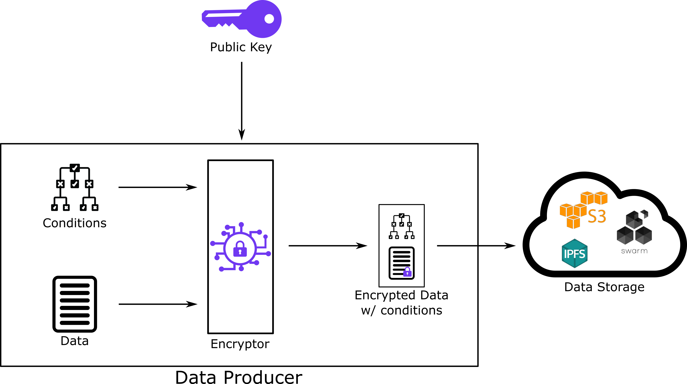
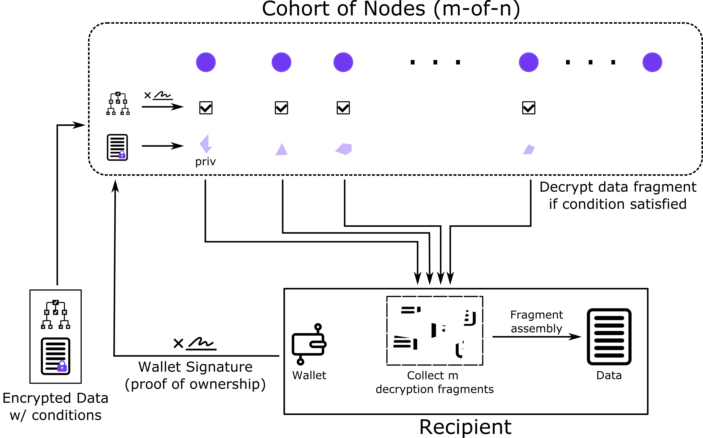

# How TACo works

## Network Setup and Management

### Distributed Key Generation (DKG)

<figure><figcaption>
Distributed Key Generation
</figcaption></figure>

We start from the _adopting developer_'s perspective – i.e. developers of an application that has integrated TACo. The Distributed Key Generation (DKG) process assigns the adopting developer the role of `cohortAuthority`. This grants the developer control over the group of nodes which enforce access control within their app, but no power to decrypt private data shared by their users. `cohortAuthority` power is easily transferred to a multisig or DAO.

The `cohortAuthority` samples a group – or cohort – of nodes from the network. Typically a list of nodes to populate a cohort is generated using a replicable random seed, to prove later that the nodes were not hand-picked.

The minimum cohort size is 30, and can be as large as 100.

Sampled nodes conduct a one-time DKG initialization ritual at network setup, which involves generating transcripts, aggregating those transcripts locally, and cross-verifying the aggregates. If any node submits an incorrect entry, the DKG ritual fails and must start over, requiring at least one honest party to ensure the secret material is not spoofed.

DKG initializations generate private and public material. The public material is used to generate a unified persistent public key. The cohort holds onto their fragment of private material, which they will later provision to qualifying data consumers.

The unified public key will be used by data producers to encrypt data, while the private fragments of the private key will later be used by each node to provide each node's decryption share to the data consumer.

### Cohort Management

The TACo protocol includes mechanisms for managing node participation over time:

- Node participation is secured through economic staking in the Threshold Network
- Cohorts can rotate members according to predefined rules set by the `cohortAuthority`
- The rotation rules can be tailored to balance security, availability, and decentralization needs
- As applications evolve, cohort composition may change to meet new requirements

## Data sharing flow

### **Encryption while specifying decryption-conditions**

<figure><figcaption>
Encryption with Conditions
</figcaption></figure>

From the _data producer_'s perspective, they want to encrypt and then share data. The data will be encrypted using the public key generated by the DKG. And along with the data, the producer specifies the conditions for accessing the data.

For example, imagine the data producer is a creator on a decentralized Twitch, and wishes to create a paywall for a special livestream. They will only allow a viewer to decrypt the stream if they (a) hold a minimum number of a special purpose NFT, (b) they need to have shared a previous stream-unlocking NFT with a friend, and (c) the stream will be non-decryptable by anyone after 24h. \
\
All these conditions are composed into a `conditionSet` and embedded with the ciphertext (the encrypted content).

The distribution of the ciphertext to recipients via a transport system and/or upload to a storage system falls outside of TACo's scope.

### **Condition-based Decryption**

<figure><figcaption>
Condition Fulfillment Decryption
</figcaption></figure>

From the _data consumer_'s perspective, their first step is getting the encrypted payload from a storage or a transport system. However, this step is outside of TACo's scope.

Next, the data consumer presents the payload to the cohort, along with whatever authentication message or proof is required to prove their identity. For example, the message can be as simple as a Sign In With Ethereum 'pass through', where the app has already authenticated the user. \
\
Then, each individual node independently verifies that the conditions are fulfilled by the data consumer – in our decentralized Twitch streamer example, this would involve retrieving on-chain state to check transaction history, NFT ownership, and blocktime. \
\
For each node that validates, if the conditions are met, a decryption fragment is provided to the consumer. Once a threshold of nodes (e.g., 26 of 50) has provided their fragments, the consumer can locally combine these fragments to decrypt the payload.

Normally, the payload is a symmetric key that then decrypts the underlying data, via a KEM/DEM mechanism.

## Key concepts

### **Threshold Decryption**

Under the hood, TACo involves splitting a joint secret – a decryption key – into multiples _shares_ and distributing those among authorized and collateralized node operators (stakers in the Threshold network). A minimum number – a _threshold_ – of those nodes holding the key shares must be online and actively participate in partial decryptions. These are subsequently combined on the requester's client to reconstruct the original plaintext data.

### **Conditionality**

Conditions are 'attached' on a per-ciphertext basis. In other words, each and every payload, message or bit can be access-restricted by a unique set of specified conditions. A range of access condition types can be defined by the _adopting developer_ and/or _data producer_:

- EVM-based\
  _e.g. Does the requester own a given NFT?_
- RPC-driven\
  _e.g. Does the requester have at least X amount of a given token in their wallet?_
- Time-based\
  _e.g. Has a predefined period elapsed, after which requests will be ignored?_

Conditions are composable and can be combined in any logical sequence or decision tree. For more on condition logic, check out the [Access Control](../conditions/) section.

### **Network parameterization**

In future versions, adopting developers (`cohortAuthority`) will have the option to tweak certain network-level parameters, which affect the collusion-resistance, redundancy, latency and costs of using TACo. These parameters mostly pertain to each cohort of nodes tasked with key material management and condition verification:

- The number of decrypting shares _n_\
  i.e. the size of the cohort
- The frequency and/or business logic for replacing members of the cohort
- The 'hand-chosen' node address that will always feature in the cohort
- The sampling mechanism for selecting cohort members

This optionality can also be surfaced for end-users – for example, in the form of 'packages' that combine network-level parameters. End-users might choose between a few discrete options, based on their trust, risk and cost preferences.
