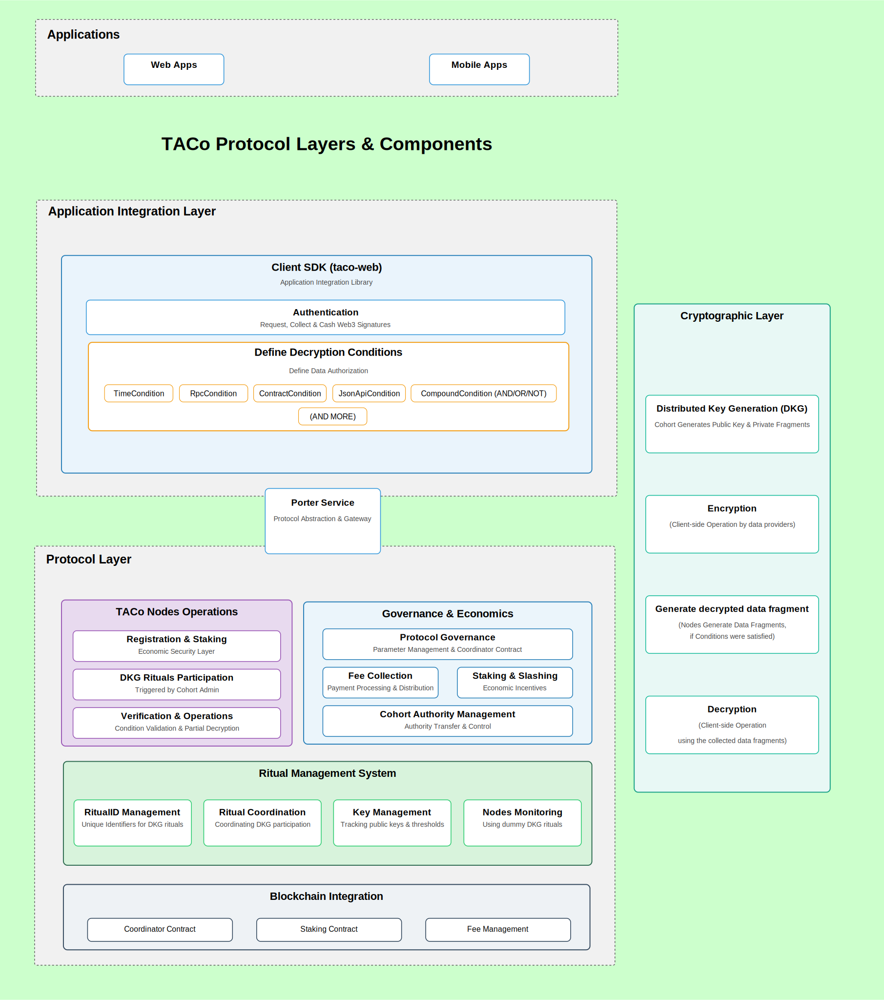

# TACo Protocol Architecture

TACo (Threshold Access Control) is a decentralized protocol that enables end-to-end encrypted data sharing with programmable access control. This document provides a comprehensive architectural overview of the protocol's components, layers, and their interactions.

<figure><figcaption>
TACo Protocol Layers & Components
</figcaption></figure>

## Architectural Overview

TACo's architecture consists of interconnected layers and components that work together to provide secure, decentralized access control:

- **Application Integration Layer** - SDK and interfaces for developers to implement TACo functionality
- **Protocol Layer** - Core services and infrastructure for network operations
- **Porter Service** - Protocol abstraction and gateway between applications and the node network
- **Web3 Integration** - multiple components interacts with blockchain networks and other decentralized infrastructure

These layers are not strictly hierarchical but rather interconnected systems that collaborate to achieve the protocol's objectives. Cryptographic operations are embedded throughout these layers to provide the security backbone of the protocol.

## Architectural Component Structure

### Protocol Operations Flow

TACo's security model is built on a sequence of cryptographic operations distributed across the protocol components:

0. **Distributed Key Generation (DKG)** - One-time setup process that generates public encryption keys and distributes private fragments across nodes

1. **Client-side Encryption** - Data producers encrypt content locally using the public key and specify access conditions

2. **Condition Verification & Fragment Generation** - Nodes independently verify conditions and provide decryption fragments when conditions are met

3. **Client-side Decryption** - Data consumers combine a threshold of fragments to decrypt content locally

This end-to-end encrypted approach ensures no single entity can access the data without meeting the specified conditions. The distribution of cryptographic operations across different actors provides security without centralized trust points.

For a detailed explanation of the end-to-end data sharing flow, including diagrams and examples, see [How TACo Works](../../getting-started/key-concepts.md).

### Layer Components

TACo's architecture is composed of several layers, each with specific components that provide key functionality:

#### Application Integration Layer

This layer bridges applications with the TACo protocol through developer-friendly interfaces:

- **Client SDK (taco-web)**: Primary toolkit for developers to integrate TACo functionality

  - Provides encrypt/decrypt APIs and cross-platform support
  - Streamlines implementation of complex cryptographic operations
  - Handles encryption and decryption operations on the client-side

- **Authentication Component**: Verifies identity through Web3 and OAuth methods

  - Manages Web3 signatures, SIWE messages, and/or OAuth flows
  - Handles identity verification before processing decryption requests
  - Provides secure authentication flow management

- **Access Control Framework**: Enables programmable access policies

  - Supports per-ciphertext access conditions
  - Implements various condition types:
    - **TimeCondition**: Time-based access using blockchain timestamps
    - **RpcCondition**: Using RPC calls to Ethereum API
    - **ContractCondition**: On-chain state and contract function calls
    - **JsonApiCondition**: External API data sources
    - **CompoundCondition**: Logical combinations (AND/OR/NOT)
    - **Additional Conditions**: Extensible for custom verification logic

- **Decryption Context Parameters Collection**: Manages parameters for decryption requests
  - Collects necessary context parameters
  - Secures transmission alongside ciphertext
  - Validates parameter integrity

#### Porter Service

Acts as a protocol abstraction and gateway layer:

- Provides an interface between applications and the TACo node network
- Simplifies protocol integration for developers
- Can be self-hosted or used as a public service (similar to Infura for Ethereum)

#### Protocol Layer

The protocol layer manages the ongoing operation of the TACo network:

- **TACo Node Client**: Manages core infrastructure operations

  - **Registration & Staking**: Economic security layer for node participation
  - **DKG Participation**: One-time key generation process triggered by Cohort Admin
  - **Condition Verification**: Independent validation of access conditions
  - **Fragment Generation**: Creation of decryption shares when conditions are fulfilled

- **Staking & Governance**: Coordinates network security

  - **Protocol Governance**: Parameter management for the protocol
  - **Staking & Slashing**: Economic incentives to ensure node compliance
  - **Node Monitoring**: System health verification
  - **Economic Security**: On-chain management via smart contracts

- **Protocol Coordination**: Manages network orchestration

  - **Ritual Coordination**: Orchestrates node participation in DKG processes
  - **RitualID Management**: Tracks unique identifiers for specific DKG rituals
  - **Protocol Management**: Handles protocol-level activities with smart contract support

- **Economic Framework**: Handles payments and incentives

  - **Fee Collection & Distribution**: Processing payments to node operators
  - **Subscription Management**: User payment models and access tiers
  - **Payment Infrastructure**: Financial transactions supported by on-chain mechanisms

#### Web3 Integration

Connects TACo to blockchain networks and decentralized infrastructure:

- **Blockchain Verification**: Uses on-chain data for condition validation
- **Blockchain Interactions**: Leverages blockchain infrastructure for governance and staking
- **Decentralized Identity**: Incorporates Web3 signatures and SIWE messages

### End-User Applications

TACo can integrate with various application types through the Application Integration Layer.

## System Actors & Interaction Model

The TACo protocol architecture defines four primary actors who interact with the system in distinct ways:

### Core System Actors

- **Adopting Developer (Cohort Authority)**: Application developers who adopt TACo, configure network parameters, and manage node cohorts
- **Data Producer**: Entities that encrypt data using TACo and define access conditions
- **Data Consumer**: Users who request and decrypt data when they meet the specified conditions
- **Node Operator**: Infrastructure providers who participate in DKG and provide decryption services

### Protocol Interaction Patterns (UML Use Cases)

TACo involves several key interaction patterns that define how actors engage with the protocol:

- **Distributed Key Generation (DKG)** - One-time setup process for generating encryption keys
- **Cohort Management** - Activities for managing node participation and parameters
- **Data Encryption with Conditional Access** - Process for securing data with programmable access rules
- **Conditional Data Decryption** - Workflow for accessing encrypted data when conditions are met

For detailed descriptions of these interaction patterns, including primary actors, supporting actors, and full interaction flows, see the [UML Use Case Diagram](./uml-usecase-diagram.md) document.

## System Interconnections

### Layer Interactions

The TACo protocol's effectiveness comes from the coordinated interactions between its components:

- **Web Applications → SDK**: End-user applications interact with the protocol through the Client SDK
- **SDK → Porter → Node Client**: The SDK communicates with nodes through Porter gateway services
- **TACo System ↔ Web3**: The protocol integrates with blockchain networks for verification and coordination
- **Node Client Operations**: Nodes participate in DKG and later provide decryption shares when conditions are met

### Data Flow Directions

- **Application Integration Flow**: Web3 & Web2 applications connect to the TACo ecosystem through the Application Integration Layer (using the Client-SDK: taco-web)
- **Layer Communication**: Components in the Application Integration Layer communicate with the Protocol Layer through Porter Service that abstracts and simplifies communication.
- **Protocol Operations Flow**:
  - DKG initialization (one-time setup by cohort authority)
  - Local encryption by data producers
  - Independent condition verification by nodes
  - Fragment provision to qualifying data consumers
  - Client-side decryption with threshold of fragments

This interconnected architecture ensures that the TACo protocol maintains security and privacy without requiring trust in any central authority, while providing developers with flexible tools for implementing sophisticated access control systems.

**Learn More:**

- For a detailed technical explanation of protocol operations, see the [Protocol Flow](./protocol-flow.md) document
- For an end-to-end overview of how data moves through the TACo ecosystem, see [How TACo Works](../../getting-started/key-concepts.md)
